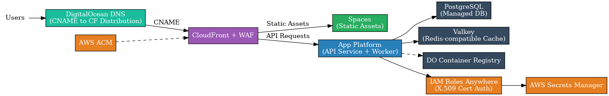

# PoC: DigitalOcean App Platform + AWS Services

A live demonstration of how DigitalOcean App Platform can seamlessly integrate with AWS services while keeping your core infrastructure cost-effective on DigitalOcean.

## **Try the Live Demo**

**Visit: https://poc-app-platform-aws.digitalocean.solutions**

The dashboard shows real-time status of integrated services with automatic updates every 30 seconds.

## What This Demo Shows

### The Dashboard
When you visit the demo URL, you'll see a status dashboard with four services:

| Service | What It Shows | Why It Matters |
|---------|---------------|----------------|
| **PostgreSQL** | Database connectivity, read/write operations | Core data storage on DigitalOcean managed databases |
| **Valkey** | Redis-compatible caching, real-time data | Fast caching layer for application performance |
| **AWS IAM Roles Anywhere** | Certificate-based authentication | Secure access to AWS without storing API keys |
| **AWS Secrets Manager** | Secret retrieval, encrypted storage | Secure credential management in AWS |

**Each row displays:**
- **Service**: The integrated component
- **Status**: Green = working, Red = issues
- **Endpoint/FQDN**: The actual connection details being used
- **Last Updated**: Timestamp showing real-time updates made by background worker every 60-seconds.
  - Timestamp of the last time a record was updated in Postgres DB
  - Timestamp of the last time a keys value was update in ValKey DB
  - Timestamp of the last time IAM Role was assumed (this would be the case for any page load and not refreshed by worker)
  - Timestamp of the last time a secret value was updated in AWS Secrets Manager

### Key Integration Points

#### **Secure Authentication**
- No AWS API keys stored anywhere in the application
- Uses X.509 certificates through AWS IAM Roles Anywhere
- Demonstrates enterprise-grade security practices

#### **Cost-Effective Hybrid Architecture**
- Core infrastructure (databases, app hosting) runs on DigitalOcean
- Selective use of AWS services where they add unique value
- CloudFront provides global CDN without moving your entire stack

#### **Real-Time Monitoring**
- Background worker continuously tests all integrations
- Dashboard updates show live health of hybrid infrastructure
- Proves the integration works continuously, not just at deployment

## Architecture Overview

The solution implements a hybrid cloud architecture that leverages the strengths of both platforms:



**Data Flow:**
1. User → CloudFront (AWS) → Spaces (DO) for static assets
2. User → CloudFront (AWS) → App Platform (DO) for API requests  
3. App Platform (DO) → PostgreSQL/Valkey (DO) for database operations
4. App Platform (DO) → IAM Roles Anywhere (AWS) → Secrets Manager (AWS)
5. Worker Service (DO) → Updates all services every 60 seconds

## Business Benefits

### **Best of Both Worlds**
- **DigitalOcean**: Simple, predictable pricing for core infrastructure
- **AWS**: Specific services where they excel (CloudFront, IAM, Secrets Manager)

### **Enterprise Security**
- Certificate-based authentication to AWS (no API keys to manage)
- Secrets stored securely in AWS Secrets Manager
- DDoS protection and rate limiting via AWS WAF

### **Simplified Operations**
- Single deployment pipeline manages both platforms
- Terraform Infrastructure as Code for reproducibility
- Real-time monitoring of cross-cloud integrations

### **Cost Optimization**
- Avoid expensive AWS RDS by using DigitalOcean managed databases
- Leverage AWS global CDN without hosting compute there
- Use AWS IAM for security without EC2 costs

## Security Demonstration: AWS WAF in Action

One of the key benefits of this hybrid architecture is enterprise-grade security through AWS WAF. The demo includes live DDoS protection that you can test yourself.

### Try the WAF Rate Limiting

The demo is protected by AWS WAF with a 100 requests per 5-minute rate limit. You can trigger this protection to see it in action:

```bash
# Clone this repository
git clone <repository-url>
cd poc-app-platform-aws

# Run the WAF test script
./test-waf.sh
```

**What you'll see:**
- ✅ First ~100 requests succeed (HTTP 200)  
- 🚫 Additional requests get blocked (HTTP 403)
- 📊 Clear summary showing when blocking started

This demonstrates real protection against:
- **DDoS attacks** - Automatic blocking of excessive requests
- **API abuse** - Rate limiting prevents service overload  
- **Resource exhaustion** - Protects your App Platform from being overwhelmed

### Why This Matters

- **No additional infrastructure** - WAF runs in AWS edge locations globally
- **Automatic protection** - No manual intervention needed during attacks
- **Cost effective** - Only pay for requests processed, not idle capacity
- **Scales infinitely** - AWS handles traffic spikes you never could on your own

## Understanding the Architecture

### Core Infrastructure (DigitalOcean)
- **App Platform**: Hosts your containerized applications
- **PostgreSQL**: Managed relational database with backups
- **Valkey**: Redis-compatible caching layer
- **Spaces**: S3-compatible object storage for static assets
- **Container Registry**: Private Docker image storage

### AWS Integration Layer
- **CloudFront + WAF**: Global CDN with DDoS protection
- **IAM Roles Anywhere**: Certificate-based authentication
- **Secrets Manager**: Encrypted secret storage and rotation
- **ACM**: SSL certificate management

### Why This Approach Works
1. **Keep expensive compute on DigitalOcean** (better pricing)
2. **Use AWS for specialized services** (global CDN, advanced security)
3. **Secure integration** via certificates (no credentials to leak)
4. **Single infrastructure pipeline** (deploy both platforms together)

## Try It Yourself

Want to deploy your own version?

1. **See the live demo first**: https://poc-app-platform-aws.digitalocean.solutions
2. **Deploy your own**: See [DEPLOY.md](./DEPLOY.md) for complete setup instructions
3. **Customize it**: Modify the Terraform files to add your own services

## Next Steps

### For Evaluation
1. Review the dashboard to understand the integration points
2. Check the API endpoints directly (listed in DEPLOY.md)
3. Review the Terraform code to understand the architecture

### For Implementation
1. Start with the core DigitalOcean infrastructure
2. Add AWS services incrementally based on your needs
3. Use the certificate-based authentication pattern for security
